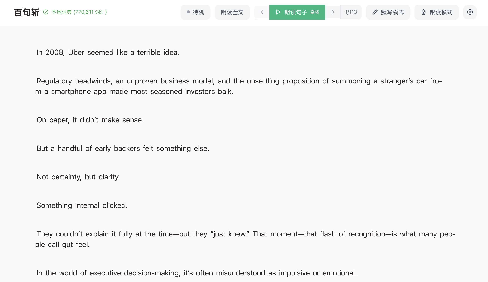
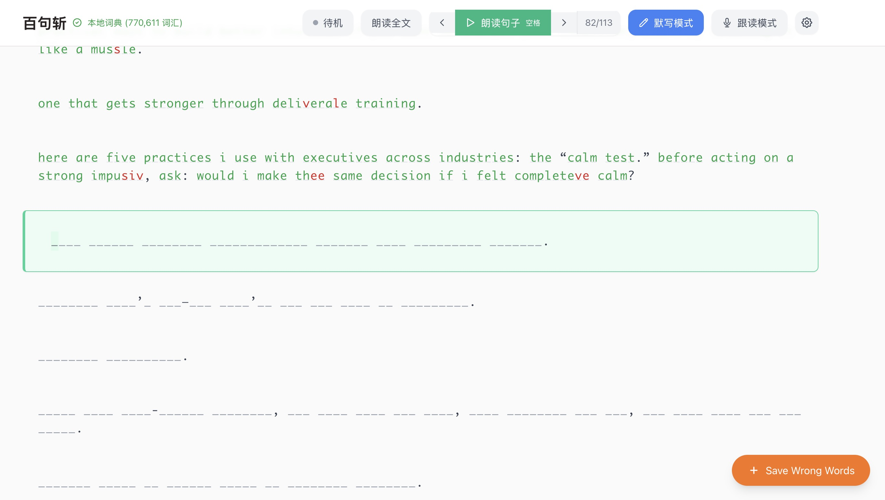
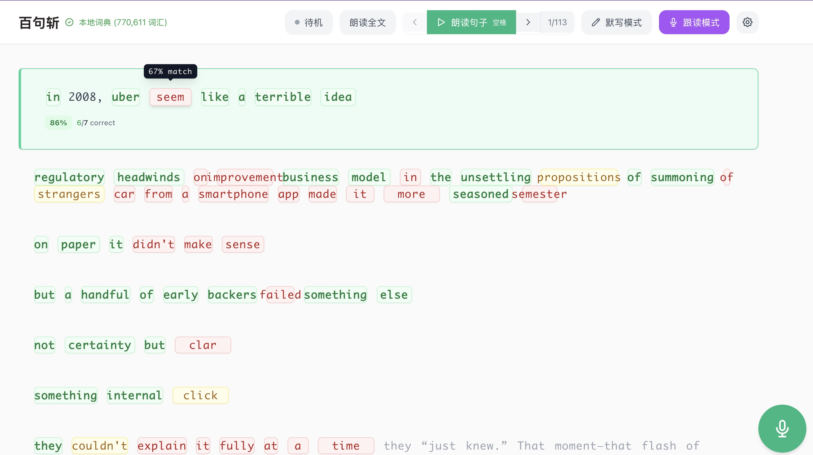

# 百句斩英语

一个免费、开源、本地运行的英语学习网站，支持自定义文本输入，以句子为核心进行学习，提供朗读、跟读、默写、字典、错题本等功能。





## 功能特性

### 🎵 语音朗读
- **智能语音选择** - 优先选择 Microsoft Edge 等高质量语音引擎
- **单词/句子/全文朗读** - 点击任意单词/句子/全文即可朗读
- **语速调节** - 支持 0.5x 到 2x 语速调节
- **音色选择** - 选择不同的音色进行朗读

### 🎤 默写模式
- **打字练习** - 逐句输入英文文本进行默写练习
- **实时反馈** - 显示输入进度和正确性（红色字符表示错误）
- **进度保存** - 自动保存练习进度到本地存储
- **智能提示** - 自动空格和单词匹配
- **错词本** - 基于红色字符检测自动记录错误的单词，方便后续复习
- **专用布局** - 错词本页面使用专用布局，包含统计信息和操作按钮

### 🗣️ 跟读模式
- **语音识别** - 使用Web Speech API进行语音转文字
- **跟读练习** - 通过阅读句子来练习英语发音和朗读
- **实时转录** - 实时显示语音识别结果
- **进度跟踪** - 跟踪朗读准确度和完成度

### 📖 字典功能
- **在线词典** - 优先使用免费的Dictionary API获取完整释义
- **离线备份** - 内置常用词汇，网络失败时自动切换
- **详细信息** - 显示音标、词性、释义和例句
- **美观弹窗** - 现代化设计的字典弹窗

## 技术栈

- **React 19** - 前端框架
- **TypeScript** - 类型安全
- **Tailwind CSS** - 原子化CSS框架
- **Vite** - 构建工具
- **Web Speech API** - 浏览器语音合成
- **SpeechRecognition API** - 浏览器语音识别服务
- **Dictionary API** - 免费在线词典服务
- **内置词典** - 内置常用词汇，网络失败时自动切换

## 浏览器支持

- ✅ Chrome/Chromium (推荐)
- ✅ Microsoft Edge (推荐)
- ✅ Firefox
- ✅ Safari
- ❌ Internet Explorer

## 开发说明

### 添加新词汇到离线词典

编辑 `src/data/offlineDictionary.ts` 文件：

```typescript
export const offlineDictionary: Record<string, DictionaryEntry> = {
  'newword': {
    phonetic: '/njuːwɜːrd/',
    meanings: [
      { 
        partOfSpeech: 'noun', 
        definition: 'A word that has been recently created.',
        example: 'This is a newword in our dictionary.'
      }
    ]
  },
  // ... 其他词汇
};
```

## 许可证

MIT License

## 贡献

欢迎提交Issue和Pull Request！
